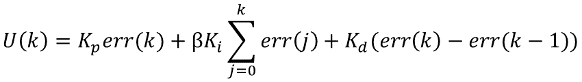
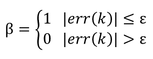
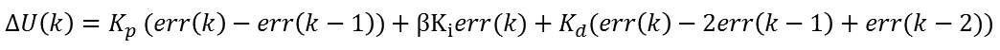
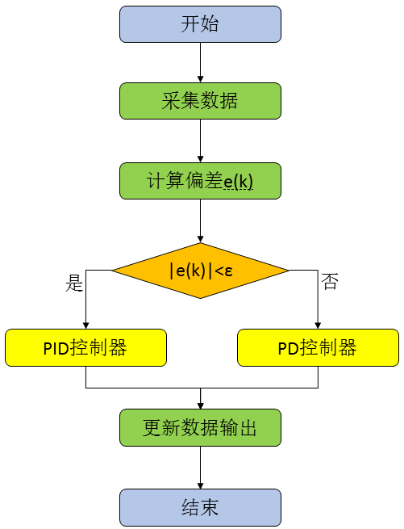

[toc]

# 积分分离PID

[PID控制器开发笔记之二：积分分离PID控制器的实现](https://www.cnblogs.com/foxclever/p/8969944.html)

## 基本思想

PID控制引入积分主要是为了消除静差，提高控制精度。但在**过程的启动、结束或大幅度增减设定值**时，短时间内系统输出有很大偏差，会造成PID运算的积分累积，引起**超调或者振荡**。为了解决这一干扰，人们引入了积分分离的思想。其思路是偏差值较大时，取消积分作用，以免于超调量增大；而偏差值较小时，引入积分作用，以便消除静差，提高控制精度。

具体的实现步骤是：根据实际情况，设定一个阈值；当偏差大于阈值时，消除积分仅用PD控制；当偏差小于等于阈值时，引入积分采用PID控制。则控制算法可表示为：



其中β称为积分开关系数，其取值范围为：



积分分离算法的效果其实与ε值的选取有莫大关系，所以ε值的选取实际上是实现的难点，ε值过大则达不到积分分离的效果，而ε值过小则难以进入积分区，ε值的选取存在很大的主观因素。

对于经典的增量式PID算法，似乎没有办法由以上的公式推导而来，因为β随着err(k)的变化在不是修改着控制器的表达式。换一种角度考虑，每次系统调节未定后，偏差应该为零，然后只有当设定值改变时，系统才会响应而开始调节。设定值的改变实际上是一个阶跃变化，此时的控制输出记为U0，开始调节时，其调节增量其实与之前的一切没有关系。所以我们就可以以变化时刻开始为起点，而得到带积分分离的增量算法，以保证在启动、停止和快速变化时防止超调。公式如下：



其中β的取值与位置型PID算法一致。可能有人会担心偏差来回变化，造成积分作用的频繁分离和引入，进而使上述的增量表达式无法实现。其实我们分析一下就能发现，在开始时，由于设定值变化引起的偏差大而分离了积分作用，在接近设定值时，偏差变小就引入了积分，一边消除静差，而后处于稳态，直到下一次变化。

## 算法实现



与普通的PID算法的区别，只是判断偏差的大小，偏差大时，为PD算法，偏差小时为PID算法。于是我们需要一个偏差检测与积分项分离系数β的函数。

```c
static uint16_t BetaGeneration(float error,float epsilon)
{
  uint16_t beta=0;
  if(abs(error)<= epsilon)
{
  beta=1;
}
return beta;
}
```

### 位置型

```c
/*定义结构体和公用体*/

typedef struct

{

  float setpoint;       //设定值

  float proportiongain;     //比例系数

  float integralgain;      //积分系数

  float derivativegain;    //微分系数

  float lasterror;     //前一拍偏差

  float result; //输出值

  float integral;//积分值

  float epsilon; //偏差检测阈值

}PID;
```


```c
void PIDRegulation(PID *vPID, float processValue)

{

  float thisError;

  thisError=vPID->setpoint-processValue;

  vPID->integral+=thisError;

  uint16_t beta= BetaGeneration(error, vPID->epsilon);

  if(beta>0)

{

  vPID->result=vPID->proportiongain*thisError+vPID->derivativegain*(thisError-vPID->lasterror);

}

else

{

vPID->result=vPID->proportiongain*thisError+vPID->integralgain*vPID->integral+vPID->derivativegain*(thisError-vPID->lasterror);

}


  vPID->lasterror=thisError;

}
```

### 增量型

```c
/*定义结构体和公用体*/

typedef struct

{

  float setpoint;       //设定值

  float proportiongain;     //比例系数

  float integralgain;      //积分系数

  float derivativegain;    //微分系数

  float lasterror;     //前一拍偏差

  float preerror;     //前两拍偏差

  float deadband;     //死区

  float result; //输出值

  float epsilon; //偏差检测阈值

}PID;
```


```c
void PIDRegulation(PID *vPID, float processValue)

{

  float thisError;

  float increment;

  float pError,dError,iError;


  thisError=vPID->setpoint-processValue; //得到偏差值

  pError=thisError-vPID->lasterror;

  iError=thisError;

  dError=thisError-2*(vPID->lasterror)+vPID->preerror;

  uint16_t beta= BetaGeneration(error, vPID->epsilon);

  if(beta>0)

{

increment=vPID->proportiongain*pError+vPID->derivativegain*dError;   //增量计算

}

else

{

increment=vPID->proportiongain*pError+vPID->integralgain*iError+vPID->derivativegain*dError;   //增量计算

}

  vPID->preerror=vPID->lasterror;  //存放偏差用于下次运算

  vPID->lasterror=thisError;

  vPID->result+=increment;

}
```

## 总结

积分分离算法的思想非常简单。当然，对于β的取值，很多人提出了改进措施，例如分多段取值，设定多个阈值ε1、ε2、ε3、ε4等，不过这些阈值也需要根据实际的系统来设定。除了分段取值外，甚至也有采用函数关系来获取β值。当然，这样处理后就不再是简单的积分分离了，特别是在增量型算法中，实际上已经演变为一种变积分算法了。已经偏离了积分分离算法的设计思想，在后面我们会进一步说明。