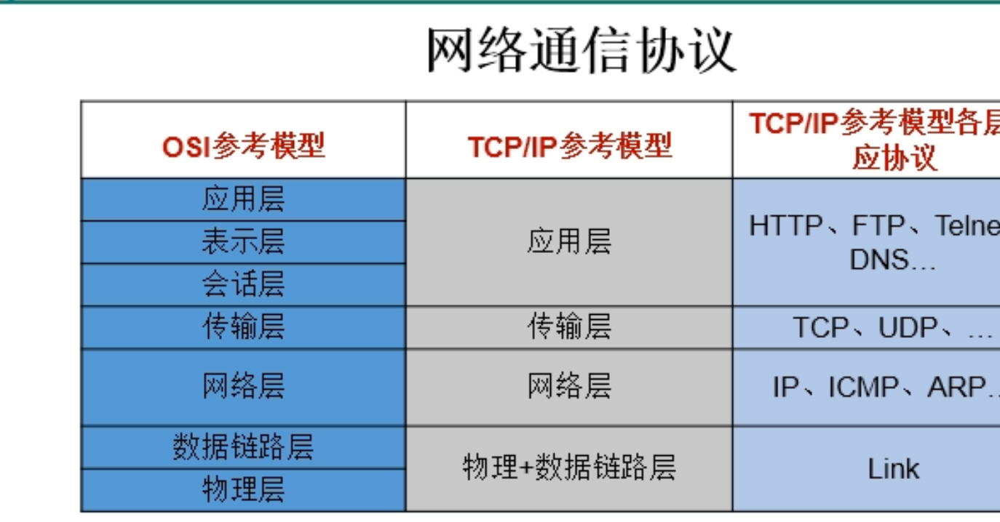

[TOC]
# 网络基础
## 网络编程的目的
直接或间接地通过网络协议与其他计算机实现数据交换，进行通讯
## 网络编程中两个主要问题
* 如何准确地定位网络上一台或多台主机，定位主机上的特定应用
* 找到住后如何可靠高效地进行数据传输

# 网络通信要素
1. 通信双方地址
   * IP
   * 端口
2. 一定的规则（网络通信协议）
   * OSI参考模型：模型过于理想化，分为七层：应用层、表示层、会话层、传输层、网络层、数据链路层、物理层
   * TCP/IP参考模型（TCP/IP协议），分为：应用层（HTTP、FTP、Telnet、DNS等协议）、传输层（TCP、UDP等协议）、网络层（IP、ICMP、ARP等协议）、物理+数据链路层（Link协议）

dfj 